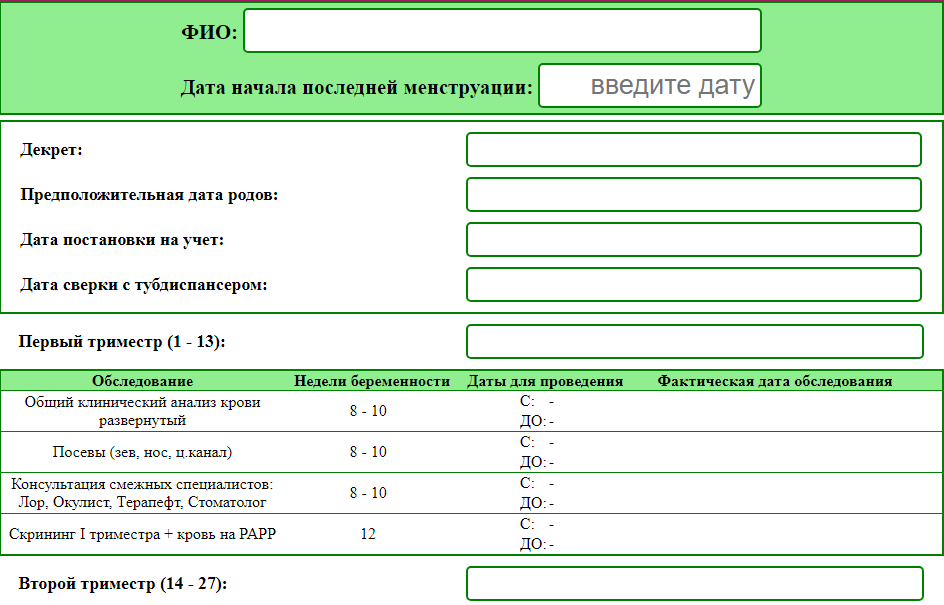
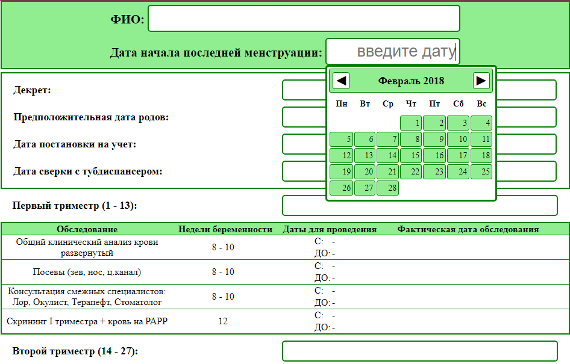
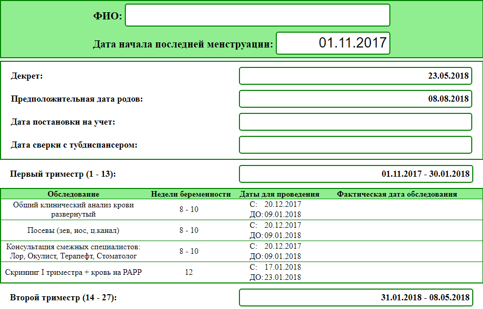

# wdays

1. [Описание](#Описание)
2. [Установка](#install)
3. [Базовые данные](#Базовые-данные)
    - [Основной конфигурационный файл](#Основной-конфигурационный-файл)
    - [Изменение таблиц обследований](#Изменение-таблиц-обследований)
4. [Скриншоты](#Скриншоты)

## <a name="Описание">Описание</a>
Расчет дат проведения обследований при ведении беременности

## <a name="install">Установка</a>
1. <a href="./download/wdays.zip">Скачать архив</a>
2. Разархивировать
3. Открыть `wdays.html` в браузере

## <a name="Базовые-данные">Базовые данные</a>
### <a name="Основной-конфигурационный-файл">Основной конфигурационный файл</a>
```
    app\js\config.js
```

Конфигурационный файл содержит функцию `Periods()`, которая возвращает массив трех объектов, содержащих данные о триместрах:

- **description** - описание триместра
- **firstWeek** и **lastWeek** - начальная и конечная недели триместра. На странице выводятся в скобках после описания триместра
- **events** - список объектов, из которых формируется таблица обследований каждого триместра

### <a name="Изменение-таблиц-обследований">Изменение таблиц обследований</a>
Каждый объект триместра содержит список `events`, в котором через запятую перечислены объекты каждого обследования:

```javascript
{
    "description": "<описание>",
    "firstWeek": <целое число>,
    "lastWeek": <целое число>
},
{
    "description": "<описание>",
    "firstWeek": <целое число>,
    "lastWeek": <целое число>
},
{
    "description": "<описание>",
    "firstWeek": <целое число>,
    "lastWeek": <целое число>
},
```

Каждый такой объект состоит из:

- **description** - описание обследования. Выводится в первой колонке таблицы
- **firstWeek** и **lastWeek** - начальная и конечная недели беременности для проведения обследования. Выводятся через дефис во второй колонке таблицы

и при формировании таблицы становится ее строкой.

Поэтому:

1. изменяя порядок их следования
2. добавляя новые
3. изменяя значения полей

таких объектов, можно формировать свои таблицы.

**Важно помнить:**
- объекты перечисляются через запятую
- поля каждого объекта перечисляются через запятую
- нельзя изменять имена полей объекта
- если обследование необходимо провести в течение одной недели, то нужно указать номер этой недели и в поле **firstWeek** и в поле **lastWeek**

## <a name="Скриншоты">Скриншоты</a>
##### Рис.1 Начальная страница:

##### Рис.2 Выбор даты:

##### Рис.3 Заполненная страница:
